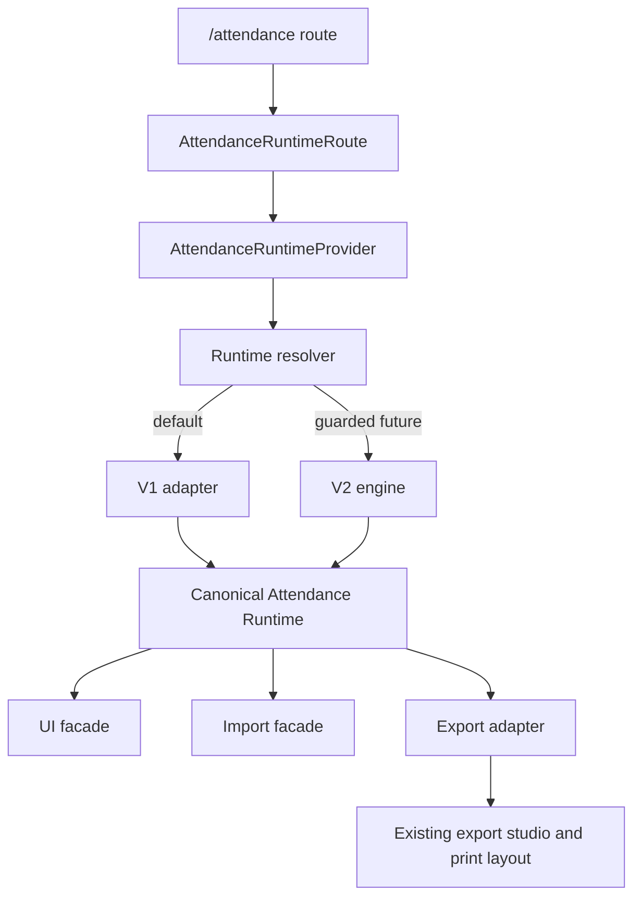

# ARCHITECTURE OVERVIEW: Attendance V2

## Objective
Design a dual-engine Presensi architecture that keeps V1 active and untouched while V2 is built, tested, shadowed, and eventually switched on through configuration only.

## Evidence from actual repo files
- `docs/plans/attendance/discovery/PHASE_-1_COMPLETION_REPORT.md`: Phase -1 passed, but implementation is blocked by route/runtime, table compatibility, and export adapter decisions.
- `apps/frontend/src/app/App.tsx:114`: `/attendance` currently renders `Attendance` directly, so the runtime provider is not the active boundary yet.
- `apps/frontend/src/features/attendance/runtime/attendanceRuntime.config.ts`: runtime config files already exist and default to V1.
- `apps/frontend/src/features/attendance/runtime/attendanceRuntimeGuard.ts`: V2 is currently guarded as not implemented and forced back to V1.
- `apps/frontend/src/pages/Attendance.tsx`: V1 UI, data orchestration, import/OCR wiring, and export dataset assembly are coupled in one page.
- `apps/frontend/src/hooks/useAttendance.ts`: active V1 hook reads/writes `attendance_records`, `attendance_holidays`, `attendance_day_events`, and `attendance_locks`.
- `apps/frontend/src/components/import/ImportAttendanceDialog.tsx`: Excel import still writes `attendance`, creating a compatibility gap.
- `apps/frontend/src/components/export/AttendanceExportPreviewV2.tsx`, `apps/frontend/src/lib/attendancePrintLayout.ts`, and `apps/frontend/src/lib/attendancePdfExport.ts`: export parity depends on the existing print dataset and layout planner.

## Findings
The target architecture must be a strangler-style shell around V1, not a rewrite of V1. The first safe production change is a route/runtime wrapper that still renders V1 by default and exposes a future canonical runtime contract.

Core architectural rule:
- V1 internals stay as production authority until runtime cutover.
- V2 never imports V1 page, hook, helper, or table-specific mapper.
- UI, import, export, reports, tests, and backend contracts use the canonical model only.
- Rollback is a runtime-engine config change to `v1`, not a deploy or migration.

## Target architecture layers
| Layer | Owner | Responsibility | Must not do |
|---|---|---|---|
| Route shell | `apps/frontend/src/features/attendance/runtime` | Resolve active engine and mount the correct runtime boundary. | Import V2 into current V1 page directly. |
| V1 adapter | `apps/frontend/src/features/attendance/v1` | Wrap V1 output into canonical shape while delegating behavior to the locked V1 path. | Modify `Attendance.tsx` or `useAttendance.ts`. |
| V2 engine | `apps/frontend/src/features/attendance/v2` and `apps/backend/src/modules/attendance` | New calendar/rule/status/lock engine in isolation. | Import V1 code or write V1 tables directly. |
| Canonical contracts | `packages/attendance-contracts` | Shared schema for runtime, API, export, shadow, and tests. | Depend on frontend-only or backend-only implementation details. |
| Export adapter | `apps/frontend/src/features/attendance/export` | Convert canonical attendance data into existing `AttendancePrintDataset`. | Change PDF/PNG/Excel format in Phase 01. |
| Shadow/migration | backend module and/or Supabase function/RPC later | Compare V1 and V2 outputs without interrupting V1. | Block V1 writes when V2 shadow fails. |

## Runtime data flow
1. Route loads `AttendanceRuntimeRoute`.
2. Runtime resolver reads config in this priority: emergency server config, local developer override, env default, hard default `v1`.
3. Registry returns engine descriptor: `v1-adapter`, `v2-shadow`, or `v2-active`.
4. Active engine returns canonical records, holidays, day events, locks, summaries, and commands.
5. UI/export/import consume canonical runtime surface only.
6. If V2 fails, provider reports telemetry and falls back to V1 when fallback is allowed.

## Failure modes
| Failure | Expected behavior |
|---|---|
| V2 module throws during init | Keep V1 active, log `runtime_fallback`. |
| Runtime config is invalid | Resolve `v1`, log `invalid_runtime_config`. |
| Shadow write fails | V1 user action remains successful; log shadow failure. |
| Canonical mapping mismatch | Block Phase 12 cutover; do not block V1. |
| Export adapter cannot map canonical dataset | Fallback to V1 export path while V1 is active; fail closed for V2 cutover. |

## Risks
- `BLOCKER`: `/attendance` bypasses runtime provider today.
- `BLOCKER`: `attendance` and `attendance_records` table ownership must be decided before import/shadow work.
- `HIGH`: existing export parity is sensitive to `AttendancePrintDataset`.
- `HIGH`: V1 page currently owns too much behavior, so the first seam must be minimal and reversible.

## Safe next action
Phase 01 should implement only the runtime route shell with V1 as the default and only active engine. It must not change V1 behavior, export output, import behavior, OCR behavior, or database writes.

## Blockers
- No V2-active runtime until the `attendance` vs `attendance_records` compatibility decision is approved.
- No export migration until canonical-to-print adapter tests prove output parity.
- No backend write cutover until shadow mode can compare V1 and V2 deterministically.
