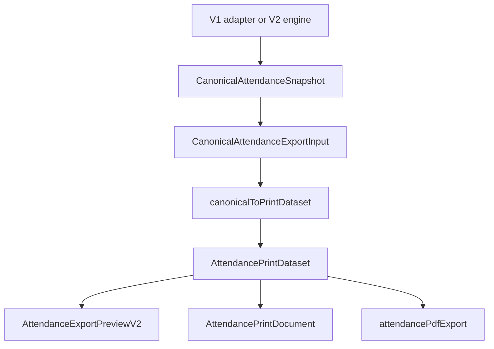

# EXPORT SAFE ARCHITECTURE: Attendance V2

## Objective
Design the export boundary so PDF, PNG, print, Excel, and preview behavior remain stable while V1 and V2 engines change behind a canonical adapter.

## Evidence from actual repo files
- `docs/plans/attendance/export/STUDIO_EXPORT_COMPATIBILITY.md`: Studio Export must remain compatible with existing preview/export behavior.
- `apps/frontend/src/pages/Attendance.tsx`: builds `attendancePreviewData`, `attendancePrintDataset`, and studio data before passing to export components.
- `apps/frontend/src/components/export/AttendanceExportPreviewV2.tsx`: preview and output are intentionally coupled for parity.
- `apps/frontend/src/components/export/AttendancePrintDocument.tsx`: single renderer receives print dataset and layout plan.
- `apps/frontend/src/lib/attendancePrintLayout.ts`: layout planner is the single source of truth for print layout.
- `apps/frontend/src/lib/attendancePdfExport.ts`: PDF export consumes the print dataset/layout plan.

## Findings
Export must not know whether records came from V1 or V2. The safe seam is canonical snapshot -> `AttendancePrintDataset` adapter -> existing export pipeline.

## Export data flow

## Adapter responsibilities
`canonicalToPrintDataset` owns:
- student row ordering;
- day/date column generation;
- status labels and counts;
- holiday/event/lock context projection;
- workday format handling;
- signature metadata pass-through;
- exact field names expected by existing export components.

It must not:
- query Supabase;
- inspect runtime engine internals;
- change existing export layout metrics;
- decide V1 vs V2;
- mutate canonical snapshot.

## Compatibility gate
Before V2 export is enabled:
1. Capture a V1 canonical fixture from a known class/month.
2. Generate print dataset through existing V1 page path.
3. Generate print dataset through canonical adapter.
4. Compare headers, row count, dates, status counts, holiday marks, lock labels, and signature metadata.
5. Render PDF/PNG preview and compare layout metrics against existing planner output.

## Failure modes
| Failure | Required behavior |
|---|---|
| Adapter missing required field | Block V2 export; keep V1 export path while V1 active. |
| Layout metrics differ | Treat as `HIGH` export regression. |
| V2 snapshot lacks holiday/event context | Block V2 export until canonical snapshot is complete. |
| Export fails after cutover | Runtime rollback to V1 and log export error. |

## Test gate
- Unit: canonical export adapter maps records/statuses/days correctly.
- Unit: empty month, all absent, all present, holiday, day event, locked month.
- Snapshot: print dataset parity with V1 fixture.
- Visual/manual: preview and PDF/PNG remain aligned.
- Regression: export does not import `v1/*` or `v2/*`.

## Risks
- `HIGH`: current export data is assembled in `Attendance.tsx`, not an isolated export adapter.
- `HIGH`: PDF/PNG/preview parity can break if adapter recomputes layout instead of reusing planner.
- `MEDIUM`: Excel/CSV may require additional raw-data fields not needed by PDF.

## Safe next action
Document the canonical-to-print adapter test fixture before implementing export adapter code. Phase 01 must not change export output.

## Blockers
- No V2 export path until canonical snapshot includes all fields V1 export needs.
- No export renderer edit during runtime-shell phase.
