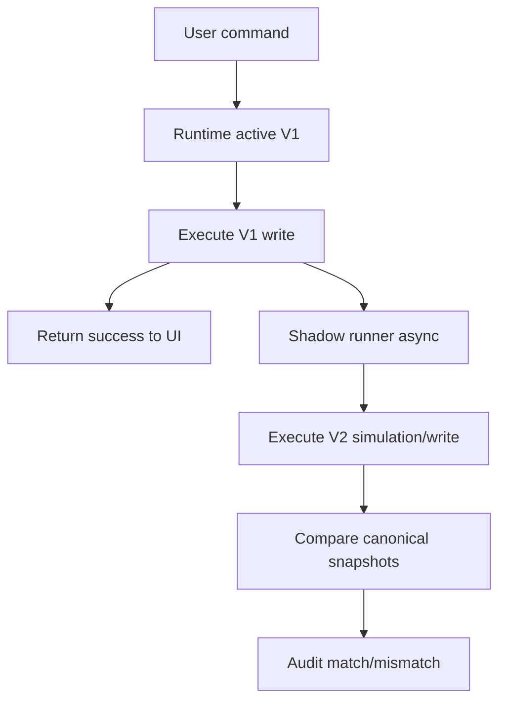

# MIGRATION SAFE ARCHITECTURE: Attendance V2

## Objective
Define a no-big-bang migration architecture where V1 remains the production authority until V2 proves parity through shadow mode.

## Evidence from actual repo files
- `docs/plans/attendance/migration/STRATEGY.md`: migration must use a strangler pattern and shadow mode.
- `docs/plans/attendance/discovery/DISCOVERY_DATABASE_TOUCHPOINTS.md`: active V1 hook uses `attendance_records`, while legacy paths still reference `attendance`.
- `supabase/functions/delete-semester-data/index.ts`: cleanup touches both `attendance_records` and `attendance` in some flows.
- `supabase/functions/process-account-deletion/index.ts`: account deletion references legacy `attendance`.
- `apps/frontend/src/components/import/ImportAttendanceDialog.tsx`: import writes `attendance`.
- `apps/frontend/src/pages/Attendance.tsx`: OCR import uses `attendance_records`.

## Findings
Migration cannot start as schema replacement. The first migration task is compatibility classification: which table is authoritative for each flow, what legacy rows mean, and how imports/deletes are reconciled.

## Migration phases
| Phase | Mode | Production authority | V2 action |
|---|---|---|---|
| 01 Runtime shell | V1 active | V1 | None; route wrapper only. |
| 03 Canonical read | V1 active | V1 | Map V1 reads to canonical snapshots. |
| 06 V2 local engine | V1 active | V1 | Compute V2 output from canonical fixtures. |
| 09 Shadow mode | V1 active | V1 | Async V2 write/compare, no user impact. |
| 11 Candidate cutover | V2 shadow/limited active | V1 fallback | V2 active for limited cohort/config. |
| 12 Cutover | V2 active | V2 | V1 remains rollback fallback. |

## Shadow mode architecture

## Data compatibility decision required
Before any shadow write:
- classify `attendance_records` as current production table or not;
- classify `attendance` as legacy/import-only/archive table or not;
- define read precedence when both tables have rows for the same class/date/murid;
- define cleanup/account-deletion target tables;
- define whether legacy `attendance` rows must be migrated into `attendance_records` before shadow.

## Data integrity rules
- V1 write success must not depend on V2 shadow success.
- Shadow rows must not appear in V1 UI/export.
- Duplicate `(classId, studentId, date)` must have deterministic conflict behavior.
- Lock validation must be identical before cutover.
- Date normalization must be deterministic and timezone-safe.
- Import/OCR writes must be classified before cutover.

## Observability
Shadow audit event should include:
- request id;
- class id;
- date/month;
- engine pair;
- command type;
- V1 result hash;
- V2 result hash;
- mismatch fields;
- severity;
- timestamp;
- user id or safe hash.

## Test gate
- Table compatibility tests with both `attendance` and `attendance_records`.
- Shadow diff tests for match, status mismatch, note mismatch, missing row, duplicate row.
- Migration idempotency tests.
- Cleanup/account deletion coverage tests.
- Locked month and holiday/event conflict tests.

## Risks
- `BLOCKER`: active vs legacy table ownership unresolved.
- `HIGH`: import flows may create data invisible to V1 hook/export.
- `HIGH`: account deletion may leave active presensi rows if table list is incomplete.
- `MEDIUM`: shadow mode can increase load if run synchronously or too broadly.

## Safe next action
Create `ATTENDANCE_TABLE_COMPATIBILITY_DECISION.md` before any migration or shadow implementation.

## Blockers
- No shadow writes until storage targets, RLS, audit destination, and cleanup behavior are decided.
