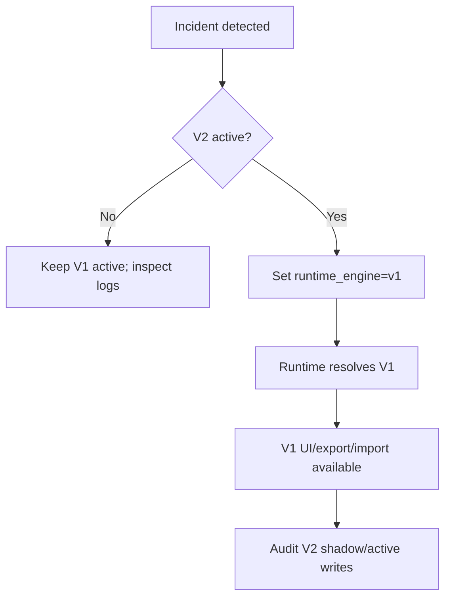

# ROLLBACK BLUEPRINT: Attendance V2

## Objective
Define rollback mechanics that restore V1 immediately through runtime configuration, without schema rollback, redeploy, export changes, or data repair.

## Evidence from actual repo files
- `docs/plans/attendance/03_RUNTIME_SWITCH.md`: engine must be selectable by `runtime_engine = "v1 | v2"`.
- `apps/frontend/src/features/attendance/runtime/attendanceRuntime.config.ts`: runtime override concepts already exist.
- `apps/frontend/src/features/attendance/runtime/attendanceRuntimeGuard.ts`: guard can force V1 when V2 is not implemented.
- `docs/plans/attendance/discovery/DISCOVERY_RISK_REPORT.md`: route bypass and table compatibility are blockers.

## Findings
Rollback is only credible if V1 remains runnable, data remains compatible, and export can still use V1 path. Therefore V2 must be introduced behind a route/runtime shell and shadow storage must never corrupt V1 production rows.

## Rollback levels
| Level | Trigger | Action | Expected time |
|---|---|---|---|
| Soft fallback | V2 read/init error | Runtime provider resolves V1 locally. | Immediate for current session. |
| Config rollback | V2 issue in production | Set runtime config to `v1`. | Immediate after config propagation. |
| Emergency guard | Critical V2 release bug | Force guard to deny V2. | Requires deploy only if remote config is unavailable. |
| Data rollback | V2 active write issue | Use audit/shadow log to reconcile affected rows. | Manual, only after cutover phase. |

## Rollback config priority
Emergency remote `v1` override must outrank local overrides and env defaults. A user session should never be able to force V2 when emergency config says V1.

## Rollback path

## Failure handling rules
- If V2 read fails, fallback to V1 is allowed.
- If V2 write fails before commit, report error and do not write partial data.
- If V2 write succeeds but post-export fails, runtime can rollback for future sessions, but affected data needs audit.
- If shadow mode fails, V1 user action remains successful.

## Observability
Each fallback/rollback event records:
- requested engine;
- resolved engine;
- reason;
- route;
- user safe id/hash;
- class id if applicable;
- timestamp;
- client version;
- error code.

## Test gate
- Resolver test: emergency V1 wins.
- Runtime test: invalid V2 config resolves V1.
- Browser test: after switching to V1 config, `/attendance` renders V1.
- Export smoke: V1 export still works after rollback.
- Shadow audit test: failed shadow does not affect user success.

## Risks
- `BLOCKER`: rollback cannot be instant if route bypasses runtime.
- `HIGH`: rollback cannot recover corrupted V1 table writes; V2 must not write V1 authority before cutover.
- `MEDIUM`: localStorage override can make developer testing appear different from production config.

## Safe next action
Phase 01 must prove V1-default route wrapper and invalid-config-to-V1 fallback before any V2 engine work.

## Blockers
- Remote config source is not yet selected.
- Data rollback cannot be fully designed until table compatibility is approved.
