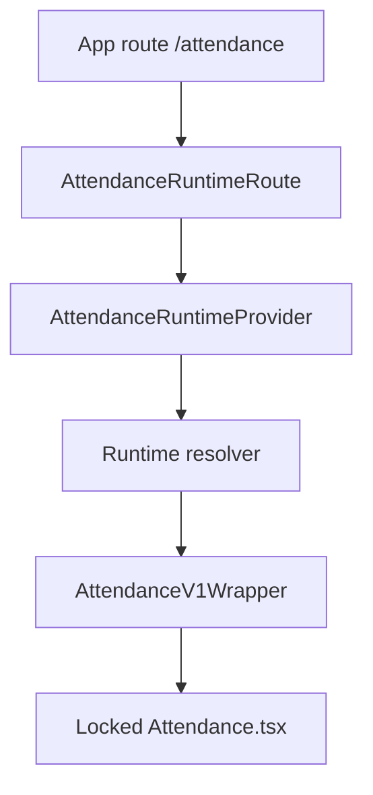

# RUNTIME ROUTE WRAPPER SPEC: Attendance V2 Phase 01

## Objective
Define the exact Phase 01 route wrapper implementation target that wires `/attendance` into the runtime system while preserving V1 behavior.

## Evidence from actual repo files
- `apps/frontend/src/app/App.tsx:114`: current route renders `<Attendance />` directly.
- `apps/frontend/src/features/attendance/runtime/AttendanceRuntimeProvider.tsx`: runtime provider already exists but is not used by the active route.
- `apps/frontend/src/features/attendance/v1/AttendanceV1Wrapper.tsx`: V1 wrapper exists and renders the locked V1 page.
- `apps/frontend/src/features/attendance/runtime/attendanceRuntimeGuard.ts`: V2 is guarded off.
- `docs/plans/attendance/discovery/V1_TO_CANONICAL_SEAM.md`: minimum safe seam is route/runtime wrapper outside V1 internals.

## Findings
Phase 01 must be intentionally boring: route wiring only, V1 default, V2 unavailable. The wrapper is considered correct only if V1 UI, import, OCR, export, localStorage, and database behavior are unchanged.

## Target modules
Allowed Phase 01 files:
```txt
apps/frontend/src/app/App.tsx
apps/frontend/src/features/attendance/runtime/AttendanceRuntimeRoute.tsx
apps/frontend/src/features/attendance/runtime/AttendanceRuntimeProvider.tsx
apps/frontend/src/features/attendance/runtime/attendanceRuntime.config.ts
apps/frontend/src/features/attendance/runtime/attendanceRuntime.registry.ts
apps/frontend/src/features/attendance/runtime/attendanceRuntimeGuard.ts
apps/frontend/src/features/attendance/v1/AttendanceV1Wrapper.tsx
apps/frontend/src/features/attendance/runtime/*.test.ts
```

Forbidden Phase 01 files:
```txt
apps/frontend/src/pages/Attendance.tsx
apps/frontend/src/hooks/useAttendance.ts
apps/frontend/src/components/import/ImportAttendanceDialog.tsx
apps/frontend/src/components/import/OCRImportDialog.tsx
apps/frontend/src/components/export/*
apps/frontend/src/lib/attendancePrintLayout*
apps/frontend/src/lib/attendancePdfExport*
supabase/**
```

## Wrapper contract
```ts
export function AttendanceRuntimeRoute(): JSX.Element {
  return (
    <AttendanceRuntimeProvider>
      <ResolvedAttendanceRuntime />
    </AttendanceRuntimeProvider>
  );
}
```

`ResolvedAttendanceRuntime` rules:
- if resolved engine is `v1`, render `AttendanceV1Wrapper`;
- if requested engine is `v2` but V2 guard is false, render `AttendanceV1Wrapper`;
- if config is invalid, render `AttendanceV1Wrapper`;
- do not render V2 UI in Phase 01;
- do not pass new props into V1 unless the existing wrapper already supports them.

## Resolver acceptance
| Input | Expected Phase 01 result |
|---|---|
| no config | `v1-active` |
| `VITE_ATTENDANCE_ENGINE=v1` | `v1-active` |
| `VITE_ATTENDANCE_ENGINE=v2` | `v1-active`, reason `guarded` |
| `attendance_engine_override=v2` | `v1-active`, reason `guarded` |
| invalid value | `v1-active`, reason `invalid-config` |

## Data flow


## Failure modes
- Provider failure must render V1 fallback or a clear fatal error; never partial V2.
- Resolver invalid config must not throw.
- LocalStorage access failure must default to V1.
- V1 wrapper render must not be blocked by runtime telemetry.

## Test gate
- Unit test runtime resolver cases.
- Source guard that `App.tsx` imports `AttendanceRuntimeRoute`, not V2 internals.
- Source guard that `Attendance.tsx` and `useAttendance.ts` are unchanged.
- Browser smoke on `/attendance` proves V1 page renders.
- Manual smoke verifies import/export/OCR entry points still appear under V1.

## Risks
- `BLOCKER`: editing V1 directly invalidates Phase 01.
- `HIGH`: route wrapper can accidentally remount V1 and reset state if provider state changes too often.
- `MEDIUM`: localStorage override can confuse testing if not surfaced in diagnostics.

## Safe next action
Implement Phase 01 runtime wrapper with V1-only behavior and commit as an isolated change.

## Blockers
- Do not enable V2, shadow mode, or backend APIs in Phase 01.
