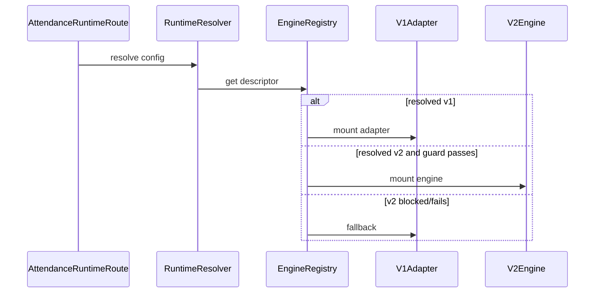

# RUNTIME SWITCH BLUEPRINT: Attendance V2

## Objective
Specify a config-controlled runtime switch that can choose V1 or V2 without editing V1, changing export format, rewriting schema, or requiring redeploy for rollback.

## Evidence from actual repo files
- `apps/frontend/src/features/attendance/runtime/attendanceRuntime.config.ts`: resolver already has env/localStorage concepts and defaults to `v1`.
- `apps/frontend/src/features/attendance/runtime/attendanceRuntimeGuard.ts`: V2 is currently blocked by `IS_V2_IMPLEMENTED=false`.
- `apps/frontend/src/features/attendance/runtime/AttendanceRuntimeProvider.tsx`: provider exists but is not mounted at `/attendance`.
- `apps/frontend/src/app/App.tsx:114`: active route bypasses the runtime provider.
- `docs/plans/attendance/03_RUNTIME_SWITCH.md`: switch must not require DB migration, code rewrite, or export change.

## Findings
The runtime switch must be a route-level shell first, not a deep change inside V1. The switch may resolve V2 only when all guards pass. Until then, every config value must collapse to V1.

## Runtime resolver priority
1. Emergency remote config: `attendance_runtime_engine = "v1"` always wins when available.
2. Developer override: `localStorage.attendance_engine_override`, only in non-production or explicit debug mode.
3. Environment default: `VITE_ATTENDANCE_ENGINE`.
4. Hard default: `v1`.

Invalid values resolve to `v1`.

## Engine registry contract
```ts
export type AttendanceEngineId = "v1" | "v2";

export type AttendanceRuntimeMode =
  | "v1-active"
  | "v2-shadow"
  | "v2-active";

export interface AttendanceEngineDescriptor {
  id: AttendanceEngineId;
  mode: AttendanceRuntimeMode;
  label: string;
  isImplemented: boolean;
  canRead: boolean;
  canWrite: boolean;
  canExport: boolean;
  fallbackEngine: "v1" | null;
}

export interface AttendanceRuntimeResolution {
  requestedEngine: AttendanceEngineId;
  resolvedEngine: AttendanceEngineId;
  mode: AttendanceRuntimeMode;
  reason: "config" | "guarded" | "invalid-config" | "fallback" | "emergency";
}
```

## Frontend runtime flow


## Backend runtime flow
Backend runtime does not exist yet. When introduced, it must use the same descriptor semantics and reject V2 writes unless:
- engine is implemented,
- authenticated user owns the target class,
- table compatibility decision is approved,
- shadow mode is explicitly enabled or V2 is active.

## Failure modes
| Failure | Resolution |
|---|---|
| Missing config | `v1-active`, reason `config`. |
| Unknown config value | `v1-active`, reason `invalid-config`. |
| V2 requested but not implemented | `v1-active`, reason `guarded`. |
| V2 render/init error | `v1-active`, reason `fallback`. |
| Remote emergency flag says V1 | `v1-active`, reason `emergency`. |

## Test gate
- Unit: resolver priority and invalid values.
- Unit: V2 guard always forces V1 until `IS_V2_IMPLEMENTED=true`.
- Source guard: `/attendance` route imports only `AttendanceRuntimeRoute`, not V2 internals.
- Browser smoke: `/attendance` renders identical V1 surface with default config.
- Regression: export, import, OCR buttons still appear and call V1 behavior while resolved V1.

## Risks
- `BLOCKER`: mounting runtime inside `Attendance.tsx` violates V1 lock.
- `HIGH`: fallback that silently switches during writes can hide data mismatch.
- `MEDIUM`: localStorage override can confuse support if enabled in production.

## Safe next action
Phase 01 may implement `AttendanceRuntimeRoute` and wire `/attendance` to it, with V1 as the only operational engine.

## Blockers
- V2 cannot be enabled until the registry can prove implementation, canonical parity, export adapter parity, and table compatibility.
