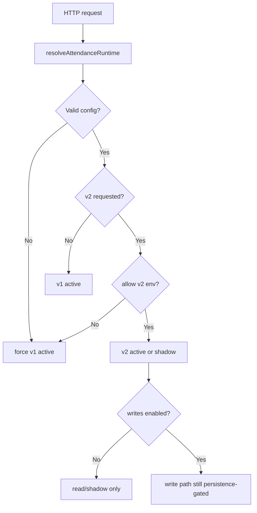

# RUNTIME MIDDLEWARE FINAL: Attendance Phase 07

## Objective
Document how backend runtime context is resolved, guarded, and attached to attendance orchestration.

## Evidence from Actual Repo Files
- Runtime resolver: `apps/backend/src/modules/attendance/runtime/attendanceRuntime.ts`
- Controller usage: `apps/backend/src/modules/attendance/attendance.controller.ts`

## Findings
Phase 07 implements runtime resolution as a controller-level middleware function because the current backend uses `node:http` directly.

Runtime inputs:
- `ATTENDANCE_BACKEND_ENGINE`
- `ATTENDANCE_BACKEND_MODE`
- `ATTENDANCE_BACKEND_ALLOW_V2`
- `ATTENDANCE_BACKEND_ENABLE_WRITES`
- optional `ATTENDANCE_RUNTIME_ADMIN_KEY`
- optional `ATTENDANCE_DEBUG` or `ATTENDANCE_DEBUG_KEY`

Guard rules:
1. Missing config defaults to `v1` + `active`.
2. Invalid engine/mode forces `v1` + `active`.
3. Requested `v2` is rejected unless `ATTENDANCE_BACKEND_ALLOW_V2=true`.
4. Writes are enabled only when engine is `v2`, mode is `active`, and `ATTENDANCE_BACKEND_ENABLE_WRITES=true`.
5. Runtime mutation requires `x-sipena-admin-key` matching `ATTENDANCE_RUNTIME_ADMIN_KEY`.
6. Shadow report requires admin or debug access.

## Risks
- `MEDIUM`: In-memory runtime override resets on backend restart.
- `LOW`: There is no global middleware stack in the current backend, so each future attendance controller must call the resolver.

## Safe Next Action
If the backend framework is expanded later, lift `resolveAttendanceRuntime` into a shared request middleware without changing its guard rules.

## Blockers
- Do not allow V2 or writes from request headers alone.
