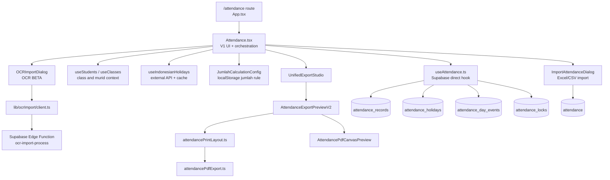
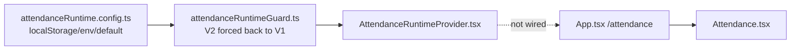

# DISCOVERY DEPENDENCY GRAPH: Attendance V1

## Objective
Document the current dependency graph for Attendance V1 so the next phase can add a runtime/adapter layer without guessing or touching V1 internals.

## Evidence from actual repo files
- `apps/frontend/src/app/App.tsx:28` and `apps/frontend/src/app/App.tsx:114`: direct route import/render for `Attendance`.
- `apps/frontend/src/pages/Attendance.tsx:38-85`: imports `useAttendance`, import dialogs, OCR helpers, export studio, export preview, attendance components, and export layout/PDF/debug helpers.
- `apps/frontend/src/pages/Attendance.tsx:394-399`: page binds directly to `useAttendance`.
- `apps/frontend/src/pages/Attendance.tsx:621-675`: page combines national holidays, custom holidays, and workday logic.
- `apps/frontend/src/pages/Attendance.tsx:695-869`: page builds preview/export datasets from filtered murid, month days, holidays, events, notes, and counts.
- `apps/frontend/src/pages/Attendance.tsx:3207-3305`: page wires import menu and `UnifiedExportStudio`.
- `apps/frontend/src/pages/Attendance.tsx:4944-5025`: page wires Excel import and OCR import.
- `apps/frontend/src/hooks/useAttendance.ts:56-138`: hook queries attendance tables.
- `apps/frontend/src/hooks/useAttendance.ts:199-456`: hook mutates attendance records, holidays, day events, and locks.
- `apps/frontend/src/components/import/ImportAttendanceDialog.tsx:167-174`: Excel import writes to `attendance`.
- `apps/frontend/src/lib/ocrImport/client.ts:13-18`: OCR frontend invokes Supabase Edge Function `ocr-import-process`.
- `supabase/functions/ocr-import-process/index.ts:1-13`: Edge Function uses Groq models, max body/image/row limits, and no DB write path in the shown pipeline.
- `apps/backend/src/modules`: only `auth`, `health`, and `users`; no attendance module found.

## Findings

## Risks
- `BLOCKER`: runtime-switch components exist but are not part of the actual app route.
- `HIGH`: `Attendance.tsx` is a multipurpose orchestrator; changing props or return shapes can break UI, import, export, and tour in one change.
- `HIGH`: Excel import bypasses `useAttendance` and writes to `attendance`, creating a divergent dependency graph.
- `MEDIUM`: export depends on page-computed dataset shape, not a standalone backend or canonical provider.
- `LOW`: backend app has no attendance module, so no NestJS backend dependency must be preserved for V1.

## Safe next action
Introduce the adapter at the boundary between page-level V1 data and canonical data only after route-level runtime wrapping is proven with V1 unchanged. For export, the adapter should produce `AttendancePrintDataset`/canonical export data rather than replacing export renderers.

## Blockers
- Do not wire runtime switch in Phase -1.
- Do not refactor `Attendance.tsx`, `useAttendance.ts`, import, OCR, export, or schema in Phase -1.
