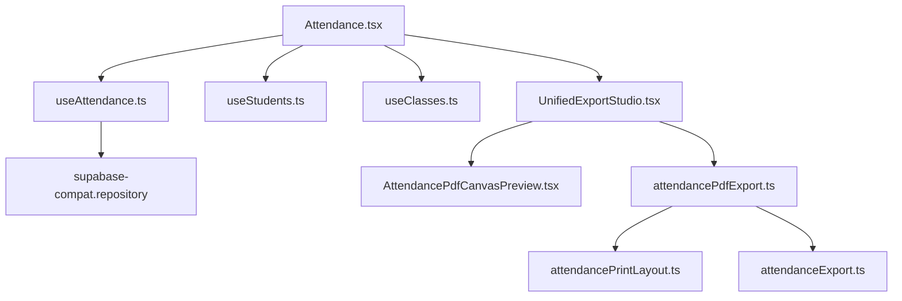

# DISCOVERY DEPENDENCY GRAPH: Attendance V1

## Objective
Provide a precise dependency graph showing imports, exports, dataflow, and component relationships in the legacy Attendance V1 system.

## Evidence from Actual Repo Files
- **Imports in Page**:
  - `import { useAttendance } from "@/hooks/useAttendance"`
  - `import { useStudents } from "@/hooks/useStudents"`
  - `import { useClasses } from "@/hooks/useClasses"`
  - `import { UnifiedExportStudio } from "@/components/export/UnifiedExportStudio"`
- **Hook Data Source**:
  - `useAttendance.ts` imports `supabaseExternal` from `@/core/repositories/supabase-compat.repository` and performs direct queries on `attendance_records`, `attendance_holidays`, `attendance_day_events`, and `attendance_locks`.

## Findings
The graph of dependencies can be modeled as follows:

## Risks
- **Direct Database Dependency**: `useAttendance.ts` queries raw Supabase rows directly. It exposes the database shape to the page component without intermediary mapping.
- **Export Coupling**: The export preview (`AttendanceExportPreviewV2.tsx`) depends on calculations from `attendancePrintLayout.ts` and raw statuses directly.

## Safe Next Action
- Ensure that the export preview and layout functions only depend on a **Canonical Attendance Model** rather than legacy database records or raw hook results.
