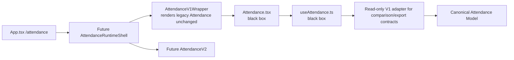

# V1 TO CANONICAL SEAM

## Objective
Define the minimum safe adapter seam that can represent Attendance V1 as a canonical model without modifying `Attendance.tsx`, `useAttendance.ts`, export renderers, import dialogs, OCR, or database schema during discovery.

## Evidence from actual repo files
- `apps/frontend/src/hooks/useAttendance.ts:7-41`: V1 types include attendance records, holidays, day events, locks, workday format, and status values.
- `apps/frontend/src/hooks/useAttendance.ts:546-582`: hook returns records, derived getters, mutators, loading/saving flags, and refetch.
- `apps/frontend/src/pages/Attendance.tsx:394-399`: page destructures the hook directly.
- `apps/frontend/src/pages/Attendance.tsx:695-809`: page converts V1 state into preview rows/days/totals.
- `apps/frontend/src/pages/Attendance.tsx:811-869`: page converts preview data into print dataset and studio data.
- `apps/frontend/src/features/attendance/canonical/canonical.types.ts:1-20`: canonical status/record draft already includes `H/S/I/A/D/L/-`.
- `apps/frontend/src/features/attendance/canonical/canonical.types.ts:42-71`: canonical day, event, holiday, and lock types exist.
- `apps/frontend/src/features/attendance/canonical/canonical.types.ts:106-127`: canonical dataset and export dataset types exist.
- `apps/frontend/src/features/attendance/v1/AttendanceV1Wrapper.tsx:1-10`: wrapper renders legacy `Attendance` unchanged.
- `apps/frontend/src/features/attendance/runtime/attendanceRuntime.config.ts:6-37`: runtime config can read localStorage/env/default.
- `apps/frontend/src/features/attendance/runtime/AttendanceRuntimeProvider.tsx:8-23`: provider resolves guarded active engine but is not active in route.

## Findings

### Minimum seam placement
The lowest-risk seam is **outside** V1 page/hook internals:

### Canonical fields required from V1
- Records: `id`, `classId`, `studentId`, `date`, `status`, `note`.
- Murid metadata: `id`, `name`, `nisn`.
- Class metadata: `id`, `name`, optional `classKkm`.
- Days: `date`, `isEffective`, `dayOfWeek`, optional holiday/event labels.
- Holidays: custom holidays and national holidays, with `"Hari Kerja"` override preserved.
- Events: `date`, `label`, `description`, `color`.
- Locks: `classId`, normalized month, `isLocked`, `lockedAt`, `lockedBy`.
- Preferences: `attendance_work_format`, `sipena_jumlah_config`, selected export columns/style/signature when export parity is tested.

### Adapter invariants
- `H`, `I`, `S`, `A`, `D` must map one-to-one.
- `L` must remain a derived day-cell/export value, not a saved `attendance_records.status`.
- `-` must remain an empty/no-record display state.
- V1 month lock stores month as `yyyy-MM-dd` month start; canonical model should expose `YYYY-MM` while preserving raw month in metadata if needed.
- Custom `"Hari Kerja"` overrides a national/weekend holiday and must not become a holiday in canonical day output.
- Export adapter must keep `AttendancePrintDataset` semantics stable: row numbering, `cells`, `totals`, `days`, `notes`, `holidayItems`, and `eventItems`.

## Risks
- `BLOCKER`: in-place replacement of `useAttendance` would modify V1 and violate the locked-system contract.
- `BLOCKER`: runtime shell must render V1 unchanged before it can select V2.
- `HIGH`: adapter must account for Excel import legacy table if shadow validation compares database directly rather than hook output.
- `HIGH`: canonical lock month format mismatch can silently unlock/lock wrong months if normalized incorrectly.
- `MEDIUM`: localStorage preferences are outside Supabase and must be explicitly included in comparison/export tests.
- `LOW`: existing `AttendanceV1Wrapper` is simple and safe as a render wrapper, but not sufficient as a data adapter.

## Safe next action
Create two documents before coding:
1. `docs/plans/attendance/architecture/RUNTIME_ROUTE_WRAPPER_SPEC.md` - exact wrapper behavior, fallback, and proof that V1 rendering remains unchanged.
2. `docs/plans/attendance/database/ATTENDANCE_TABLE_COMPATIBILITY_DECISION.md` - decision on `attendance` vs `attendance_records`, cleanup functions, and import ownership.

After those docs, Phase 01 can add a runtime shell that defaults to V1 and does not alter V1 files.

## Blockers
- Do not implement adapter code in Phase -1.
- Do not change route wiring until Phase 01.
- Do not change export/import/database until their dedicated phases and compatibility decisions are complete.
