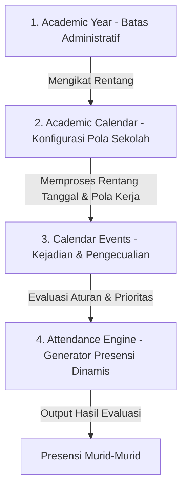

# ARSITEKTUR MESIN KALENDER AKADEMIK (ACADEMIC CALENDAR ENGINE - ACE) SIPENA

Dokumen ini merangkum perancangan ulang model domain dan mesin logika presensi untuk SIPENA. Proposal ini menggeser paradigma dari sistem yang *berorientasi pada tahun ajaran / hari libur* menjadi sistem **Academic Calendar Engine (ACE)** yang fleksibel, dinamis, dan berbasis pada kondisi riil sekolah di Indonesia.

---

## 1. Pergeseran Paradigma Filosofis

Pada sistem tradisional, terdapat asumsi bahwa *Kalender mengikuti Tahun Ajaran*. Namun di dunia nyata, yang terjadi justru sebaliknya: **Tahun Ajaran mengikuti Kalender Akademik yang ditetapkan oleh masing-masing sekolah**.

Setiap sekolah memiliki tanggal mulai, tanggal selesai, libur keagamaan, dan penyesuaian darurat yang unik. Hubungan administrasi yang benar adalah menempatkan Kalender Akademik sebagai sumber kebenaran tunggal (*source of truth*), di mana tahun ajaran dan semester hanyalah bagian penanda administrasi dari kalender tersebut.

---

## 2. Arsitektur 4-Layer Academic Calendar Engine (ACE)

Mesin Kalender Akademik dirancang sebagai empat lapisan terpisah namun saling terintegrasi secara modular:



### Layer 1: Academic Year (Tahun Ajaran)
Mendefinisikan batas administratif sekolah tanpa mengetahui hari libur maupun semester:
- Tahun ajaran (misal: 2026/2027).
- Tanggal mulai dan tanggal selesai tahun ajaran.
- Status keaktifan administratif.

### Layer 2: Academic Calendar (Kalender Akademik Sekolah)
Mengatur aturan dasar operasional harian sekolah pada satu tahun ajaran:
- Pola Hari Kerja: 5 Hari Kerja (Senin–Jumat) atau 6 Hari Kerja (Senin–Sabtu).
- Aturan Default Hari Efektif: Apakah Projek Penguatan Profil Pelajar Pancasila (P5) wajib mencatat presensi? Apakah Class Meeting dihitung sebagai hari sekolah?
- Zona waktu operasional sekolah.

### Layer 3: Calendar Events (Kejadian & Pengecualian)
Menyimpan semua kejadian akademik/non-akademik menggunakan model satu entitas dinamis (Google Calendar Model) dengan kolom:
- **`scope`**: `GLOBAL | SCHOOL | GRADE | CLASS | STUDENT | TEACHER`
- **`target`**: Mengidentifikasi ID target scope (ID murid, ID kelas, ID jenjang).
- **`priority`**: Skala prioritas numerik untuk menyelesaikan bentrokan pada hari yang sama.
- **`is_working_day`**: Penentu apakah hari tersebut wajib mencatat presensi atau non-efektif.
- **`repeat_rule` & `date_range`**: Mendukung penanganan event berulang (seperti Senam Jumat) dan rentang hari (seperti Pesantren Ramadan) tanpa duplikasi baris data.

### Layer 4: Attendance Engine (Mesin Evaluasi Dinamis)
Mesin logika bisnis (*Rule Engine*) yang mengevaluasi seluruh event pada tanggal kueri secara real-time untuk menentukan status akhir hari sekolah. **Jumlah hari efektif tidak disimpan di database**, melainkan dihitung secara dinamis demi menjaga konsistensi kalkulasi.

---

## 3. Pemetaan Solusi Terhadap 9 Skenario Riil Sekolah

Model domain baru ini menyelesaikan seluruh skenario kompleks sekolah dengan sangat elegan:

### Skenario 1: Hari Libur per Kelas (Study Tour Kelas 5A)
*   **Konfigurasi**: `scope = CLASS`, `target = "id_kelas_5A"`, `is_working_day = false`, `event_type = STUDY_TOUR`.
*   **Hasil**: Kelas 5A non-efektif (tidak mencatat presensi), sementara Kelas 5B dan 5C tetap belajar seperti biasa.

### Skenario 2: Libur Seluruh Sekolah (Hari Raya)
*   **Konfigurasi**: `scope = SCHOOL`, `target = NULL`, `is_working_day = false`, `event_type = HOLIDAY`.
*   **Hasil**: Berlaku global untuk semua murid di sekolah tersebut.

### Skenario 3: Libur Tingkat (Field Trip Tingkat 1)
*   **Konfigurasi**: `scope = GRADE`, `target = "1"`, `is_working_day = false`, `event_type = FIELD_TRIP`.
*   **Hasil**: Seluruh kelas di tingkat 1 (1A, 1B, 1C) menjadi non-efektif.

### Skenario 4: Libur Mata Pelajaran
*   **Konfigurasi**: `scope = SUBJECT`, `target = "id_mapel_matematika"`, `is_working_day = false`.
*   **Hasil**: Hari efektif pada jam mata pelajaran matematika tersebut dinonaktifkan (misal karena guru pendamping/peserta olimpiade), sedangkan jam mapel IPS/IPA lain pada hari yang sama tetap berjalan normal.

### Skenario 5: Kegiatan/Libur Individual (Dispensasi Murid Ahmad mengikuti O2SN)
*   **Konfigurasi**: `scope = STUDENT`, `target = "id_murid_ahmad"`, `is_working_day = true`, `event_type = SPORT`.
*   **Hasil**: Hanya murid Ahmad yang otomatis tercatat dalam tugas luar/dispensasi pada hari tersebut tanpa memengaruhi murid lain di kelasnya.

### Skenario 6: Libur/Kegiatan Berulang (Senam Jumat Pagi)
*   **Konfigurasi**: `repeat_rule = "weekly"`, `start_date = "2026-07-03"` (hari Jumat).
*   **Hasil**: Sistem otomatis memetakan kegiatan senam setiap hari Jumat tanpa membuat record berulang di database.

### Skenario 7: Rentang Hari (Pesantren Ramadan)
*   **Konfigurasi**: `start_date = "2026-03-01"`, `end_date = "2026-03-18"`, `is_working_day = true` (kegiatan wajib masuk).
*   **Hasil**: Sistem menghasilkan rentang 18 hari efektif bermerek Pesantren Ramadan hanya dari **1 baris record** database.

### Skenario 8: Konflik Tanggal & Bentrokan Prioritas
*   **Konfigurasi**:
    - Event A: Hari Libur Nasional (`priority = 100`, `is_working_day = false`)
    - Event B: Study Tour Kelas 5 (`priority = 80`, `is_working_day = true`)
*   **Hasil**: Rule engine memilih prioritas tertinggi (Event A: `100`), sehingga hari tersebut tetap libur sekolah.

### Skenario 9: Penanganan "Terlalu Banyak Hari Libur" (1000 Custom Holidays)
*   **Solusi**:
    - Mengganti entitas `Holiday` & `Event` pasif menjadi entitas tunggal `CalendarEvent` yang mendukung `repeat_rule` dan rentang tanggal (`start_date` & `end_date`).
    - Hal ini memangkas ribuan baris data kustom menjadi beberapa record terstruktur, menghemat memori, mengoptimalkan database, dan mencegah rendering lag pada UI grid presensi.

---

## 4. Evaluasi Kasus Kompleks Riil Sekolah Lainnya

Sistem ACE juga dirancang untuk menangani berbagai kondisi operasional nyata di Indonesia yang sering diabaikan:

*   **Sekolah A / B / C / D (Perbedaan Tanggal Mulai & Akhir Semester)**:
    - Kalender akademik sekolah didesain secara independen. Setiap sekolah dapat menentukan tanggal *start* dan *end* tahun ajaran mereka sendiri di bawah relasi `Academic Calendar` masing-masing, sehingga pergeseran semester di Madrasah (karena Ramadan/Lebaran) tidak memengaruhi sekolah negeri lainnya dalam server yang sama.
*   **Bencana Alam / Force Majeure (Banjir, Kabut Asap, Rapat Guru Mendadak, Pemilu TPS)**:
    - Ditangani dengan mendaftarkan event tipe `SCHOOL_CLOSURE` dengan `is_working_day = false` dan prioritas sangat tinggi (`95`). Sistem otomatis menghentikan kewajiban presensi pada hari tersebut secara aman.
*   **Belajar Daring / Hybrid / Covid-19 / Double Shift**:
    - Event tipe `ONLINE_LEARNING` diatur dengan `is_working_day = true` (tetap presensi berjalan). Untuk model Hybrid, event diset dengan `scope = CLASS` pada kelas yang belajar di rumah, sedangkan kelas lain berjalan tatap muka normal.
*   **Kalender Yayasan vs Kalender Daerah**:
    - Perbedaan hari libur yayasan (swasta) atau hari jadi kabupaten/kota (daerah) diselesaikan dengan mengatur event pada `scope = SCHOOL` untuk yayasan bersangkutan, atau menggunakan aturan regional tanpa memicu konflik global.

---

## 5. Mesin Evaluasi Aturan Hari Efektif (Effective Days Calculation Flow)

Ketika guru memuat halaman presensi untuk suatu kelas pada suatu tanggal, sistem akan memproses fungsi kalkulasi dinamis berikut:

```
1. Cari Kalender Akademik kelas tujuan.
2. Identifikasi Pola Hari Kerja kelas (5 atau 6 hari sekolah).
3. Apakah tanggal kueri merupakan akhir pekan tidak aktif? (Sabtu/Minggu).
   ├── Ya: Tandai non-efektif.
   └── Tidak: Lanjutkan ke langkah 4.
4. Kueri semua data `CalendarEvent` yang mencakup tanggal kueri dan memiliki:
   - scope = GLOBAL, atau
   - scope = SCHOOL, atau
   - scope = GRADE (sesuai tingkat kelas), atau
   - scope = CLASS (sesuai ID kelas), atau
   - scope = STUDENT (mencakup murid di kelas tersebut).
5. Apakah ada event yang ditemukan?
   ├── Tidak: Gunakan default Hari Belajar Normal (Efektif).
   └── Ya: Sortir semua event berdasarkan `priority` terbesar (Pemenang).
       └── Baca kolom `is_working_day` dari event pemenang:
           ├── true: Hari efektif belajar (Presensi dibuka).
           └── false: Hari non-efektif/Libur (Presensi ditutup).
```

---

## 6. Mekanisme Pergeseran Kalender & Rekonsiliasi Data

Salah satu masalah terbesar sekolah adalah **perubahan kalender secara mendadak di tengah tahun ajaran** (misal: pergeseran akhir semester akibat bencana). 

ACE mengatasi masalah ini melalui mekanisme **Rekonsiliasi & Notifikasi Inkonsistensi Data**:

```
                       [ Perubahan Kalender Disimpan ]
                                      ↓
                [ Jalankan Pengecekan Mundur (Reconciliation) ]
               (Bandingkan status presensi historis vs aturan baru)
                                      ↓
                      [ Temukan Selisih (Mismatches) ]
                  /                                      \
    [ Presensi Terisi di Hari Libur ]       [ Hari Efektif Baru Tanpa Presensi ]
                   │                                       │
                   ▼                                       ▼
     [ Tampilkan Dialog Peringatan ]          [ Tandai Kolom Kuning / Indikator ]
      (Guru diberi pilihan untuk):            (Guru diingatkan untuk melakukan):
  - Hapus data presensi hari tersebut       - Input susulan data presensi murid
  - Biarkan data tetap ada (Pengecualian)
```

Dengan desain modular Academic Calendar Engine ini, SIPENA akan memiliki basis logika penanggalan yang kokoh, tangguh terhadap anomali lokal, dan ramah terhadap perubahan mendadak di lapangan.
