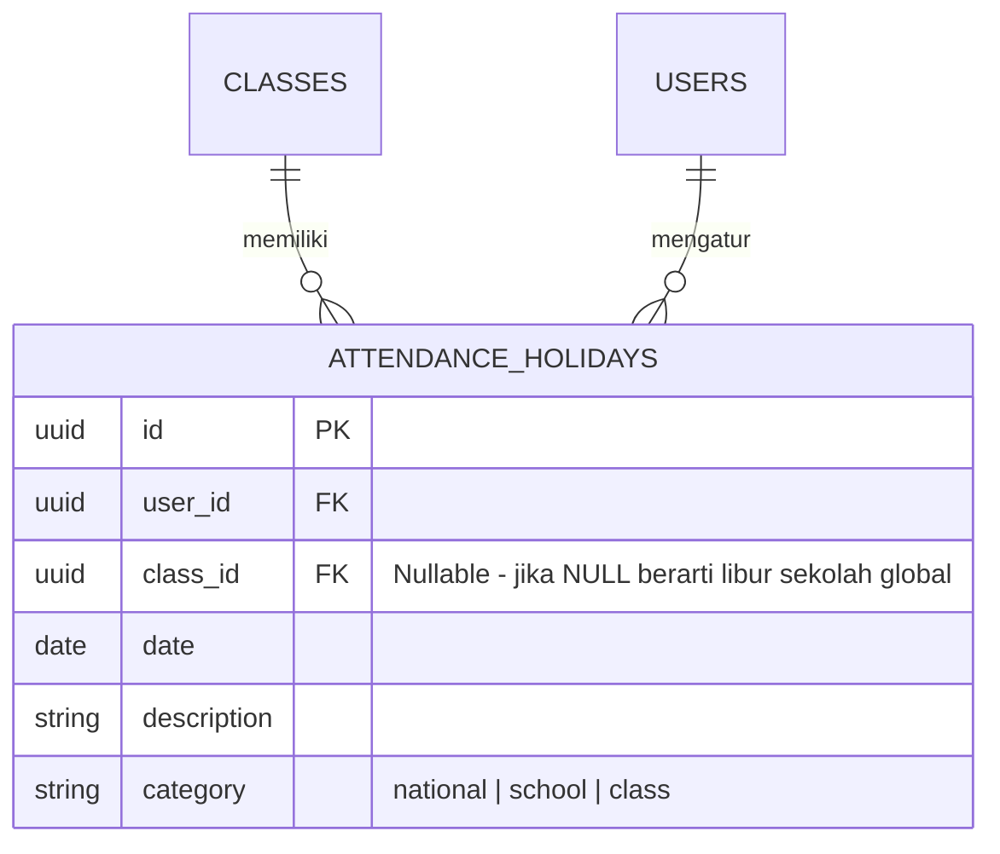

# AUDIT & RENCANA PERBAIKAN: Tata Kelola Hari Libur Kustom (Custom Holidays) & Kelemahan Sistem Presensi

Dokumen audit ini menganalisis kelemahan struktural, batasan logic, dan risiko operasional pada fitur **Hari Libur Kustom** serta modul presensi secara umum pada SIPENA. Analisis ini ditujukan untuk memberikan gambaran komprehensif mengenai celah yang belum ditangani oleh sistem saat ini, khususnya terkait skenario libur kustom, perbedaan kelas, dan limitasi performa.

---

## 1. Analisis Batasan & Kelemahan Hari Libur Kustom

Hari libur kustom dalam sistem presensi V1 (dan adaptasi awal V2) memiliki beberapa celah logika krusial:

### A. Tidak Adanya Lingkup Kelas (No Class-Level Scoping)
*   **Masalah**: Tabel `attendance_holidays` (V1) dan skema default V2 mengaitkan hari libur kustom langsung ke `user_id` (Guru/Admin) saja, tanpa adanya kolom `class_id`.
*   **Dampak Nyata**: 
    - Jika seorang Guru mengajar di Kelas A dan Kelas B, lalu menambahkan Hari Libur Kustom (misalnya "Studi Banding Kelas A"), maka tanggal tersebut otomatis akan dianggap sebagai hari libur di Kelas B juga.
    - Hal ini membuat pengaturan hari libur yang berbeda antar-kelas di bawah guru yang sama menjadi **mustahil** dilakukan. Murid-murid di kelas yang tidak berlibur akan kehilangan hak pencatatan presensi mereka pada tanggal tersebut karena sistem menandainya sebagai hari non-efektif secara global.

### B. Kerentanan Performa & Lag UI (Holiday Overflow & Lag Grid)
*   **Masalah**: Tidak ada batasan jumlah hari libur kustom yang dapat ditambahkan oleh pengguna.
*   **Dampak Nyata**:
    - **Payload Network & Memory Bloat**: Sistem memuat seluruh daftar hari libur menggunakan kueri umum `.eq("user_id", user.id)` tanpa batasan rentang waktu atau paginasi di backend. Jika pengguna menambahkan ratusan hari libur kustom secara acak atau spamming, payload JSON akan membengkak, memperlambat inisialisasi halaman presensi.
    - **Rendering Cost**: Loop pemeriksaan status hari kalender (`isHoliday(date)`) dieksekusi secara sinkron untuk setiap sel pada grid tabel presensi (Jumlah Murid $\times$ Jumlah Hari). Jika terdapat ribuan record libur di dalam memori, UI tabel akan mengalami *freeze* atau lag yang parah saat memproses scroll dan interaksi sel.

### C. Risiko Pembagian dengan Nol (Division by Zero - NaN% Attendance)
*   **Masalah**: Pengguna dapat menandai seluruh hari dalam satu bulan atau satu tahun sebagai hari libur kustom.
*   **Dampak Nyata**:
    - Jika total hari efektif sekolah dalam satu bulan/tahun menjadi `0` akibat banyaknya hari libur, rumus persentase kehadiran:
      $$\text{Rasio} = \left( \frac{\text{presentCount}}{\text{totalDays}} \right) \times 100$$
      akan menghasilkan nilai `NaN%` atau `Infinity%`.
    - Ini akan merusak komponen visual rekapitulasi, grafik performa kelas di dashboard, dan layout cetak rapor murid.

### D. Tumpang Tindih Prioritas Kalender (Calendar Priority Overlaps)
*   **Masalah**: Belum ada penanganan otomatis jika terjadi bentrokan antara hari libur nasional, hari libur kustom, kegiatan kelas (event), dan hari kerja paksa (*forced effective day*).
*   **Contoh Kasus**: 
    - Jika sebuah tanggal adalah Hari Libur Nasional resmi (dari API), tetapi guru secara tidak sengaja mendaftarkannya sebagai *Forced Effective Day* (Hari Masuk Pengganti), siapakah yang menang?
    - Jika ada libur kustom guru, namun di hari yang sama ada ujian sekolah (event sekolah dengan prioritas masuk), sistem belum memiliki resolver deterministik untuk menetapkan status default kehadiran murid.

---

## 2. Kelemahan Umum Lain pada Modul Presensi

Selain masalah hari libur kustom, berikut adalah celah operasional lain yang teridentifikasi:

1.  **Race Condition pada Pengisian Presensi Cepat**:
    - Ketika guru mengklik sel presensi secara beruntun untuk mengubah status murid dengan cepat, request dikirim secara independen tanpa antrean (*queuing system*). Jika koneksi tidak stabil, urutan penyimpanan di database bisa terbalik, menghasilkan status akhir yang salah.
2.  **Ketiadaan Fitur Riwayat Pemulihan (Undo/Redo) Presensi**:
    - Jika guru melakukan *Bulk Set Attendance* secara tidak sengaja pada seluruh murid kelas, tidak ada tombol sekali klik untuk mengembalikan (*rollback*) status presensi ke kondisi 5 menit yang lalu sebelum bulk action dijalankan.
3.  **Ketimpangan Pengaturan Format Hari Kerja (5 vs 6 Hari Sekolah)**:
    - Konfigurasi format kerja hanya disimpan sebagai state lokal atau preferensi global sederhana. Jika salah satu kelas di sekolah menerapkan 5 hari sekolah (Sabtu libur) dan kelas lain menerapkan 6 hari sekolah (Sabtu masuk), kalender presensi akan berantakan karena format hari kerja tidak diikat ke entitas kelas (`class_id`).

---

## 3. Rencana Solusi Struktural (Jangka Panjang)

Untuk mengatasi kelemahan-kelemahan di atas tanpa mengganggu performa produksi saat ini, berikut adalah rencana perbaikan skema database dan mesin logika bisnis:

### Rekomendasi Solusi Teknis:

1.  **Refaktor Skema Database (`attendance_holidays`)**:
    - Menambahkan kolom `class_id` (Foreign Key ke tabel `classes`, bersifat `NULLABLE`). Jika `class_id` bernilai `NULL`, hari libur berlaku untuk seluruh sekolah. Jika berisi ID kelas, libur hanya berlaku untuk murid-murid di kelas tersebut.
2.  **Pembatasan Kueri Berbasis Waktu (Time-Bound Fetching)**:
    - Membatasi pengambilan data hari libur di frontend hanya untuk rentang tahun ajaran yang sedang aktif (misalnya `date >= year-01-01` dan `date <= year-12-31`), bukan memuat seluruh riwayat libur kustom dari tahun-tahun sebelumnya.
3.  **Penerapan Limitasi Input (Input Validation Limits)**:
    - Membatasi jumlah hari libur kustom maksimum yang dapat ditambahkan oleh pengguna dalam satu bulan (misal maksimal 15 hari kustom) untuk mencegah serangan spam data dan menjamin ketersediaan minimal hari efektif.
4.  **Desentralisasi Konfigurasi Hari Kerja**:
    - Memindahkan konfigurasi format hari kerja (`5days` atau `6days`) dari preferensi global ke dalam kolom tabel `classes`. Sehingga kalkulasi akhir hari efektif Sabtu/Minggu disesuaikan secara otomatis per kelas secara mandiri.
5.  **Pencegahan Division by Zero**:
    - Menambahkan baris proteksi matematika pada setiap fungsi rekapitulasi: `if (totalDays === 0) return 0;` untuk mencegah rusaknya nilai persentase di rapor murid.
