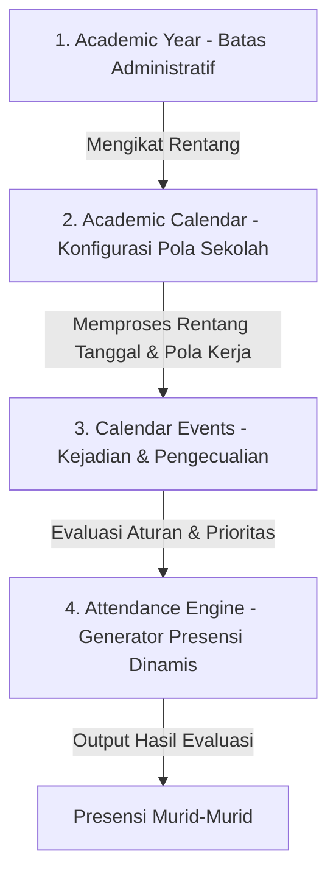

# ARSITEKTUR MESIN KALENDER AKADEMIK (ACADEMIC CALENDAR ENGINE - ACE) SIPENA

Dokumen ini merangkum perancangan ulang model domain dan mesin logika presensi untuk SIPENA. Proposal ini menggeser paradigma dari sistem yang *berorientasi pada tahun ajaran / hari libur* menjadi sistem **Academic Calendar Engine (ACE)** yang fleksibel, dinamis, dan berbasis pada kondisi riil sekolah di Indonesia.

---

## 1. Pergeseran Paradigma Filosofis

Pada sistem tradisional, terdapat asumsi bahwa *Kalender mengikuti Tahun Ajaran*. Namun di dunia nyata, yang terjadi justru sebaliknya: **Tahun Ajaran mengikuti Kalender Akademik yang ditetapkan oleh masing-masing sekolah**.

### Perbandingan Paradigma Relasi Domain:
```text
Paradigma Tradisional (Terbatas & Kaku):
Tahun Ajaran ──> Semester ──> Hari Libur (Pasif) ──> Presensi Murid

Paradigma Baru (ACE - Fleksibel & Dinamis):
Kalender Akademik (Aturan Utama)
       │
       ▼
Tahun Ajaran (Identitas Administratif)
       │
       ▼
Calendar Events (Scope, Prioritas, & is_working_day) ──> Rule Engine ──> Perhitungan Hari Efektif
                                                                               │
                                                                               ▼
                                                                        Presensi Murid
```

---

## 2. Arsitektur 4-Layer Academic Calendar Engine (ACE)

Mesin Kalender Akademik dirancang sebagai empat lapisan terpisah namun saling terintegrasi secara modular:



### Layer 1: Academic Year (Tahun Ajaran)
Mendefinisikan batas administratif sekolah tanpa mengetahui hari libur maupun semester:
- Tanggal mulai dan tanggal selesai tahun ajaran (misal: 13 Juli 2026 s.d. 18 Juni 2027).
- Status keaktifan administratif.

### Layer 2: Academic Calendar (Kalender Akademik Sekolah)
Mengatur aturan dasar operasional harian sekolah pada satu tahun ajaran:
- Pola Hari Kerja: 5 Hari Kerja (Senin–Jumat) atau 6 Hari Kerja (Senin–Sabtu).
- Konfigurasi Default Kegiatan: Apakah kegiatan Projek Penguatan Profil Pelajar Pancasila (P5) wajib mencatat presensi? Apakah Class Meeting dihitung sebagai hari sekolah?
- Zona waktu operasional sekolah.

### Layer 3: Calendar Events (Kejadian & Pengecualian)
Menyimpan semua kejadian akademik/non-akademik menggunakan model satu entitas dinamis (Google Calendar Model) dengan kolom:
- **`scope`**: `GLOBAL | SCHOOL | GRADE | CLASS | STUDENT | TEACHER`
- **`target`**: Mengidentifikasi ID target scope (ID murid, ID kelas, ID jenjang).
- **`priority`**: Skala prioritas numerik untuk menyelesaikan bentrokan pada hari yang sama.
- **`is_working_day`**: Penentu apakah hari tersebut wajib mencatat presensi atau non-efektif.
- **`repeat_rule` & `date_range`**: Mendukung penanganan event berulang (seperti Senam Jumat) dan rentang hari (seperti Pesantren Ramadan) tanpa duplikasi baris data.

### Layer 4: Attendance Engine (Mesin Evaluasi Dinamis)
Mesin logika bisnis (*Rule Engine*) yang mengevaluasi seluruh event pada tanggal kueri secara real-time untuk menentukan status akhir hari sekolah. **Jumlah hari efektif tidak disimpan di database**, melainkan dihitung secara dinamis demi menjaga konsistensi kalkulasi.

---

## 3. Resolusi Kasus Riil Sekolah di Indonesia

Menggunakan ACE, seluruh skenario kompleks di dunia sekolah diselesaikan tanpa percabangan `if-else` ad-hoc pada kode program:

| Skenario Kasus | Konfigurasi Event | Dampak Evaluasi pada Presensi |
| :--- | :--- | :--- |
| **Bencana Alam (Banjir / Kabut Asap)** | `scope = SCHOOL`<br>`priority = 95`<br>`is_working_day = false`<br>`event_type = SCHOOL_CLOSURE` | Kalender dinonaktifkan sementara untuk semua kelas pada hari kejadian. Presensi tidak dibuka. |
| **Ujian Akhir Kelas 6 (Kelas 1-5 Libur)** | **Event 1**: Kelas 6 Masuk<br>`scope = GRADE`, `target = 6`<br>`priority = 80`, `is_working_day = true`<br><br>**Event 2**: Kelas 1-5 Belajar Dirumah<br>`scope = SCHOOL`, `target = NULL`<br>`priority = 70`, `is_working_day = false` | Murid-murid Kelas 6 tetap dihitung hari efektif (presensi aktif). Murid-murid kelas 1-5 non-efektif (grid abu-abu). |
| **Study Tour Kelas 5A (5B Masuk Biasa)** | `scope = CLASS`<br>`target = "id_kelas_5A"`<br>`priority = 85`<br>`is_working_day = true`<br>`event_type = STUDY_TOUR` | Kelas 5A tetap dihitung hari belajar efektif (presensi tetap berjalan dengan penyesuaian lokasi/daring), kelas 5B normal. |
| **Rapat Koordinasi Guru (Murid Dipulangkan)** | `scope = SCHOOL`<br>`priority = 75`<br>`is_working_day = true`<br>`event_type = MEETING` | Hari tersebut tetap dihitung sebagai hari sekolah efektif bagi murid (presensi terisi hadir otomatis). |
| **Kegiatan Keagamaan Madrasah / Swasta** | `scope = SCHOOL`<br>`event_type = HOLIDAY` | Libur khusus yayasan/keagamaan disesuaikan mandiri per sekolah tanpa bentrok dengan sekolah lain dalam satu server. |

---

## 4. Mesin Evaluasi Aturan Hari Efektif (Effective Days Calculation Flow)

Ketika guru memuat halaman presensi untuk suatu kelas pada suatu tanggal, sistem akan memproses fungsi kalkulasi dinamis berikut:

```
1. Cari Kalender Akademik kelas tujuan.
2. Identifikasi Pola Hari Kerja kelas (5 atau 6 hari sekolah).
3. Apakah tanggal kueri merupakan akhir pekan tidak aktif? (Sabtu/Minggu).
   ├── Ya: Tandai non-efektif.
   └── Tidak: Lanjutkan ke langkah 4.
4. Kueri semua data `CalendarEvent` yang mencakup tanggal kueri dan memiliki:
   - scope = GLOBAL, atau
   - scope = SCHOOL, atau
   - scope = GRADE (sesuai tingkat kelas), atau
   - scope = CLASS (sesuai ID kelas), atau
   - scope = STUDENT (mencakup murid di kelas tersebut).
5. Apakah ada event yang ditemukan?
   ├── Tidak: Gunakan default Hari Belajar Normal (Efektif).
   └── Ya: Sortir semua event berdasarkan `priority` terbesar (Pemenang).
       └── Baca kolom `is_working_day` dari event pemenang:
           ├── true: Hari efektif belajar (Presensi dibuka).
           └── false: Hari non-efektif/Libur (Presensi ditutup).
```

---

## 5. Mekanisme Pergeseran Kalender & Rekonsiliasi Data

Salah satu masalah terbesar sekolah adalah **perubahan kalender secara mendadak di tengah tahun ajaran** (misal: pergeseran akhir semester akibat bencana). 

ACE mengatasi masalah ini melalui mekanisme **Rekonsiliasi & Notifikasi Inkonsistensi Data**:

```
                       [ Perubahan Kalender Disimpan ]
                                      ↓
                [ Jalankan Pengecekan Mundur (Reconciliation) ]
               (Bandingkan status presensi historis vs aturan baru)
                                      ↓
                      [ Temukan Selisih (Mismatches) ]
                  /                                      \
    [ Presensi Terisi di Hari Libur ]       [ Hari Efektif Baru Tanpa Presensi ]
                   │                                       │
                   ▼                                       ▼
     [ Tampilkan Dialog Peringatan ]          [ Tandai Kolom Kuning / Indikator ]
      (Guru diberi pilihan untuk):            (Guru diingatkan untuk melakukan):
  - Hapus data presensi hari tersebut       - Input susulan data presensi murid
  - Biarkan data tetap ada (Pengecualian)
```

Dengan desain modular Academic Calendar Engine ini, SIPENA akan memiliki basis logika penanggalan yang kokoh, tangguh terhadap anomali lokal, dan ramah terhadap perubahan mendadak di lapangan.
