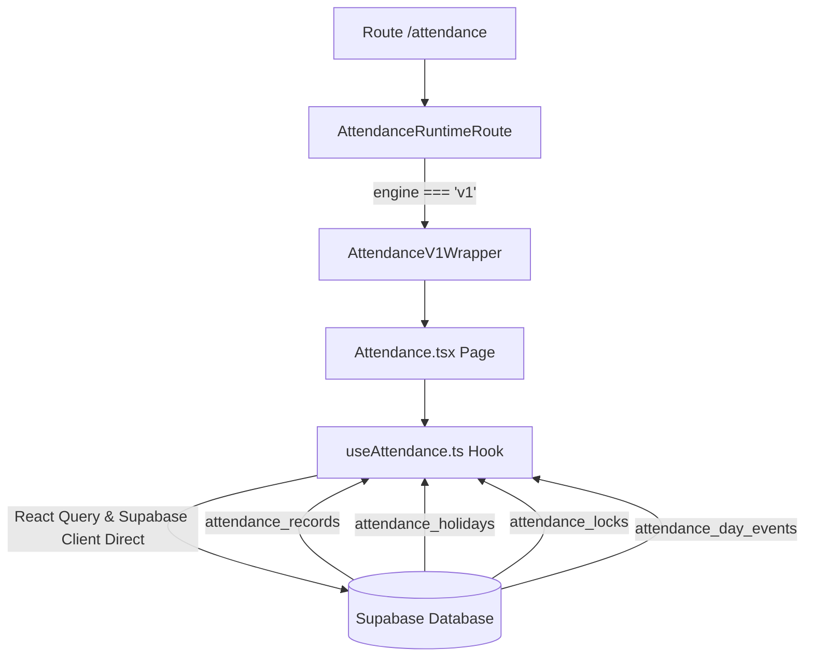
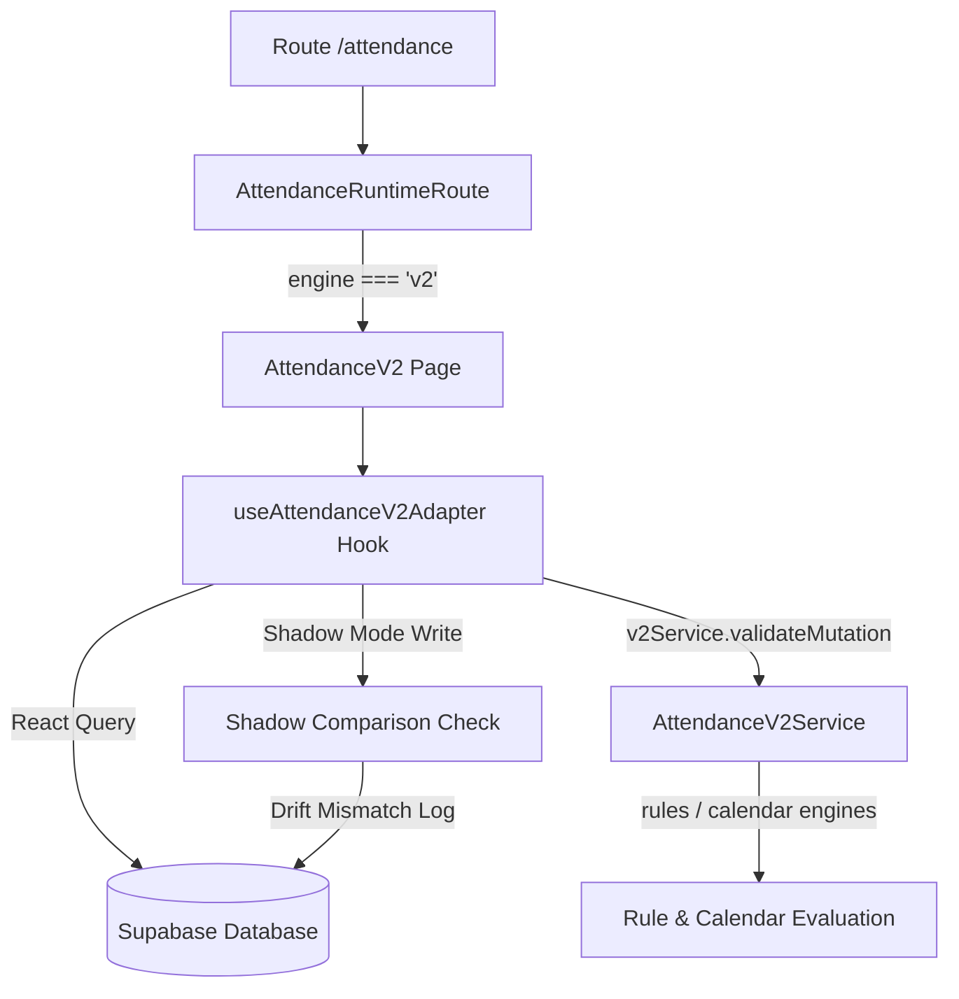

# PHASE 00: Audit Report - Attendance V1 & V2

## 1. Ringkasan Kondisi Sekarang

Modul Presensi (Attendance) di SIPENA saat ini berada dalam masa transisi dari Arsitektur Legacy (V1) menuju Arsitektur Kanonikal Baru (V2).
- **Attendance V1 (Produksi Aktif)**: Berjalan penuh di sisi client. Query dan mutasi database dikendalikan langsung oleh React Query dan Supabase client (`useAttendance.ts`). Halaman kerja UI berada di `apps/frontend/src/pages/Attendance.tsx`.
- **Attendance V2 (Siap Potong / Cutover Ready)**: Menggunakan canonical dataset model, rule engine berbasis kebijakan, calendar day generator, dan pemrosesan ringkasan server-side. Kemampuan penulisan status baru Dispensasi (`'D'`) dan per-student notes telah siap. Routing switch (`AttendanceRuntimeRoute.tsx`) dan persistence adapter (`useAttendanceV2Adapter.ts`) telah dikonfigurasi untuk memungkinkan pengaktifan engine V2 secara dinamis.

---

## 2. Diagram Alur Sistem

### Diagram Alur V1


### Diagram Alur V2 (Kondisi Saat Ini)


---

## 3. Struktur & Perbandingan Database

### Daftar Tabel V1 (Existing)
1. **`attendance_records`**
   - `id` (UUID, Primary Key)
   - `class_id` (UUID, Foreign Key)
   - `student_id` (UUID, Foreign Key)
   - `date` (DATE)
   - `status` (TEXT, check constraint: `status IN ('H', 'I', 'S', 'A')`)
   - `created_at` (TIMESTAMPTZ)
   - `updated_at` (TIMESTAMPTZ)
   - `created_by` (UUID, Foreign Key)
   - `updated_by` (UUID, Foreign Key)

2. **`attendance_holidays`**
   - `id` (UUID, Primary Key)
   - `user_id` (UUID, Foreign Key)
   - `date` (DATE)
   - `description` (TEXT)
   - `is_national` (BOOLEAN)

3. **`attendance_locks`**
   - `id` (UUID, Primary Key)
   - `class_id` (UUID, Foreign Key)
   - `month` (TEXT, format YYYY-MM)
   - `is_locked` (BOOLEAN)
   - `locked_at` (TIMESTAMPTZ)
   - `locked_by` (UUID, Foreign Key)
   - `user_id` (UUID, Foreign Key)

---

### Rancangan Tabel V2 (Dibutuhkan untuk Fungsionalitas Penuh)

Untuk mendukung fitur baru V2 (status Dispensasi `'D'`, catatan per siswa, dan label hari kegiatan custom), dilakukan perubahan schema database berikut:

1. **`attendance_records` (Modifikasi Kolom & Check Constraint)**
   - Perubahan constraint status untuk mendukung Dispensasi:
     ```sql
     ALTER TABLE attendance_records DROP CONSTRAINT IF EXISTS attendance_records_status_check;
     ALTER TABLE attendance_records ADD CONSTRAINT attendance_records_status_check CHECK (status IN ('H', 'I', 'S', 'A', 'D'));
     ```
   - Menambahkan kolom `note` (TEXT) opsional untuk menyimpan catatan khusus presensi per murid per hari:
     ```sql
     ALTER TABLE attendance_records ADD COLUMN IF NOT EXISTS note TEXT DEFAULT NULL;
     ```

2. **`attendance_day_events` (Tabel Baru)**
   - Digunakan untuk menandai hari kegiatan khusus (misal: "Ujian Tengah Semester", "Classmeeting") di kalender sekolah per user:
     ```sql
     CREATE TABLE IF NOT EXISTS attendance_day_events (
       id UUID DEFAULT gen_random_uuid() PRIMARY KEY,
       user_id UUID NOT NULL REFERENCES auth.users(id) ON DELETE CASCADE,
       date DATE NOT NULL,
       label TEXT NOT NULL,
       description TEXT,
       color TEXT DEFAULT 'blue',
       created_at TIMESTAMPTZ DEFAULT now(),
       updated_at TIMESTAMPTZ DEFAULT now(),
       UNIQUE(user_id, date)
     );
     ```
   - RLS policies lengkap (SELECT, INSERT, UPDATE, DELETE) dikonfigurasi berdasarkan `auth.uid() = user_id`.

3. **Indeks Tambahan untuk Optimasi Kinerja**:
   - `idx_attendance_day_events_user_date` pada `attendance_day_events(user_id, date)`
   - `idx_attendance_records_note` pada `attendance_records(class_id, date) WHERE note IS NOT NULL`

---

## 4. Daftar API yang Dibutuhkan

Backend Express/Node API (`apps/backend`) mengekspos endpoint-endpoint berikut di `/api/attendance`:

1. **`GET /attendance`**: Mengambil canonical dataset untuk kelas dan bulan tertentu.
2. **`POST /attendance`**: Mutasi presensi tunggal (insert, update, atau delete/set null).
3. **`POST /attendance/bulk`**: Mutasi massal (batch update).
4. **`PATCH /attendance/note`**: Update catatan khusus murid.
5. **`GET /attendance/summary/daily`**: Mengambil ringkasan harian (H/I/S/A/D counts).
6. **`GET /attendance/summary/monthly`**: Mengambil rekap presensi kelas bulanan.
7. **`GET /attendance/export-dataset`**: Menghasilkan payload dataset terformat untuk export engine.
8. **`GET/POST /attendance/runtime`**: Mengambil status runtime saat ini dan mengoverride target engine (V1/V2).

---

## 5. Fitur Frontend: V1 Parity vs. V2 New Features

### Fitur Frontend V2 yang Harus Menyamai V1
- **Visualisasi Grid Kalender**: Mendukung tampilan pembekuan kolom nama siswa (sticky freeze), highlight baris hover, tooltip KKM, dan status hari libur efektif/minggu.
- **GSAP Page Transitions**: Animasi pergantian tab, ekspansi accordion menu, dan hover tombol aksi.
- **Ekspor Dokumen**: Integrasi penuh dengan Export Studio (Cetak PDF, spreadsheet XLSX, dokumen unduhan PNG).
- **Smart OCR & Spreadsheet Import**: Pengenalan data presensi dari foto/kamera, fuzzy matching nama murid, pencocokan nomor urut absen, dan penanganan konflik file impor.

### Fitur Baru V2
- **Status Dispensasi ('D')**: Dapat dipilih di cell picker dan rekap kolom.
- **Catatan Murid Per Hari**: Tooltip atau input teks detail alasan ketidakhadiran murid pada tanggal tertentu.
- **Deteksi Lock Otomatis Lintas-Hari**: Calendar engine memblokir perubahan pada tanggal-tanggal libur efektif atau periode terkunci.

---

## 6. Gap Analysis

| Komponen | Status | Detail / Masalah | Prioritas |
| --- | --- | --- | --- |
| **Schema Migration** | Siap | File `001_ATTENDANCE_V2_MIGRATION.sql` telah disusun tetapi belum dieksekusi di database produksi (Supabase). | Tinggi |
| **API Endpoints metadata** | Belum Siap | Backend controller belum mendukung endpoint CRUD untuk `/attendance/holiday`, `/attendance/day-event`, dan `/attendance/lock`. Frontend masih menulis langsung via Supabase client. | Sedang |
| **Backend Shadow Report** | Mock | Kelas `AttendanceShadowService` di backend masih mengembalikan data statis tiruan (mock kosong) dan belum membaca data mismatch di tabel `activity_logs`. | Sedang |
| **Backend Audit Logs** | Mock (Memory Only) | Kelas `AttendanceAuditService` di backend hanya mencatat log dalam memori array, belum menulis ke tabel `activity_logs`. | Sedang |
| **Backend Tests** | Belum Siap | Sama sekali tidak ada berkas pengujian (`*.test.ts`/`*.spec.ts`) di modul backend (`apps/backend`), pengujian hanya mencakup kode frontend. | Tinggi |
| **Risiko Regresi V1** | Terkendali | Modifikasi check constraint status `'D'` di database harus dipastikan tidak memicu error tulis pada klien V1. | Tinggi |

---

## 7. Analisis Risiko & Mitigasi

1. **Risiko: Klien Legacy V1 Crash Akibat Status `'D'`**
   - *Penyebab*: Database mengembalikan status `'D'` dari record baru yang ditulis oleh klien V2, tetapi parser V1 tidak mengenali `'D'`.
   - *Mitigasi*: Bridge adapter di `useAttendance.ts` secara dinamis memetakan status `'D'` kembali ke status aman (misal: treat sebagai Izin `'I'` atau tampilkan string kosong) jika klien terdeteksi berjalan pada runtime V1.

2. **Risiko: Lock Periode Dilewati via API**
   - *Penyebab*: Validasi frontend di-bypass dan write dikirim langsung ke REST API backend.
   - *Mitigasi*: Backend service `applyPatch` di modul V2 secara ketat memuat status lock bulan terkait dari database dan menolak mutasi jika periode telah dikunci.

3. **Risiko: Overhead Log Shadow mismatch**
   - *Penyebab*: Perbedaan minor format sorting record atau date timestamp menyebabkan ribuan entri mismatch dimasukkan ke tabel `activity_logs`.
   - *Mitigasi*: Shadow comparer membandingkan dataset berbasis pencarian Map key unik `studentId:date` dan mengabaikan urutan baris murni, serta membatasi log duplikat dalam 24 jam terakhir.

---

## 8. Rekomendasi Urutan Fase Implementasi

Untuk menjamin keamanan migrasi data akademik sekolah, disarankan urutan tahapan sebagai berikut:

- **Fase 0 (Audit & Rencana)**: Menyusun mapping aliran data, analisis gap, dan mitigasi risiko regresi (SELESAI).
- **Fase 1 (Database Migration & Shadow Mode Setup)**: Menjalankan migration SQL di database Supabase untuk membuka constraint `'D'` dan membuat tabel `attendance_day_events`. Aktifkan runtime mode `shadow` di backend/frontend untuk memulai pencatatan log drift secara pasif tanpa mengganggu user.
- **Fase 2 (Peningkatan Backend & Test Coverage)**: Menambahkan endpoints CRUD calendar metadata di backend, mengganti mock shadow/audit di backend dengan logging riil ke Supabase, dan menulis integration test suite untuk `apps/backend/src/modules/attendance`.
- **Fase 3 (Uji Coba Visual & Integrasi Eksport)**: Mengaktifkan runtime engine V2 secara bertahap untuk kelompok user beta. Lakukan verifikasi manual pada layout tabel, modal edit catatan, picker dispensasi, serta presisi visual pada PDF/Excel hasil ekspor.
- **Fase 4 (Cutover & Pembersihan)**: Mengalihkan target default runtime engine secara global ke V2. Lakukan monitoring log error/drift pasca-cutover. Hapus wrapper V1 dan file-file yang tidak digunakan (deprecate V1 code) setelah sistem stabil selama 30 hari.
