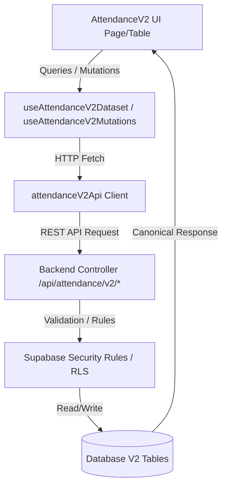

# PHASE 05: Production Frontend for Attendance V2 with V1 Visual Parity

Dokumen ini merangkum rancangan arsitektur, hierarki komponen modular, alur data (*data flow*), serta fitur-fitur baru pada antarmuka pengguna (**Frontend UI**) untuk modul **Attendance V2** SIPENA agar memiliki keselarasan tampilan (*visual parity*) 100% dengan Attendance V1.

---

## 1. Komponen Antarmuka Modular V2

Untuk menjamin skalabilitas dan pemeliharaan kode jangka panjang, antarmuka V2 dipecah menjadi komponen-komponen kecil di bawah folder `apps/frontend/src/features/attendance/v2/`:

1. **`page/AttendanceV2Page.tsx`**: Koordinator utama halaman. Mengelola status state dialog, pemanggilan adapter dataset, serta penyelarasan mutasi.
2. **`components/AttendanceV2Toolbar.tsx`**: Komponen bilah alat (*toolbar*). Menyediakan pemilih kelas (*class selector*), navigasi bulan (*month selector*), tombol penguncian (*lock*), tombol kustom libur/event, serta tombol impor/ekspor.
3. **`components/AttendanceV2Table.tsx`**: Komponen tabel kisi presensi utama. Merender baris siswa, kolom tanggal kalender bulanan, serta rekap statistik bulanan per siswa di kolom kanan.
4. **`components/AttendanceV2Cell.tsx`**: Komponen sel interaktif per tanggal per siswa. Menampilkan kode status presensi (`H`, `S`, `I`, `A`, `D`, `L`, `-`), indikator ikon catatan (*message bubble*), ikon konflik, serta *tooltip description* untuk detail aturan (*debug trace*).
5. **`components/AttendanceV2LockPanel.tsx`**: Panel status penguncian bulanan kelas.
6. **`components/AttendanceV2HolidayDialog.tsx`**: Dialog modal untuk penambahan hari libur kustom sekolah.
7. **`components/AttendanceV2DayEventDialog.tsx`**: Dialog modal untuk pengaturan kegiatan khusus kelas atau sekolah.
8. **`components/AttendanceV2NoteDialog.tsx`**: Dialog modal untuk pengisian catatan/alasan presensi siswa.
9. **`components/AttendanceV2AuditPanel.tsx`**: Panel khusus untuk menampilkan riwayat perubahan audit database V2 secara riil-time.

---

## 2. Alur Kerja Data (V2 Data Flow Contract)

Frontend V2 sepenuhnya melarang penulisan atau kueri data secara langsung ke Supabase client-side. Semua operasi dikomunikasikan secara aman melalui REST API backend:

1. **`api/attendanceV2Api.ts`**: Klien API frontend berbasis utilitas `httpRequest` untuk memanggil endpoint `/api/attendance/v2/*` dengan menyertakan token otorisasi Bearer secara aman.
2. **`hooks/useAttendanceV2Dataset.ts`**: Hook pembungkus `useQuery` react-query untuk memuat data kelas bulanan yang bersumber dari API backend.
3. **`hooks/useAttendanceV2Mutations.ts`**: Hook pembungkus `useMutation` untuk memicu mutasi (kunci, presensi, catatan, libur, event) serta melakukan invalidasi otomatis terhadap cache data saat berhasil disimpan.

---

## 3. Fitur Parity V1 & Peningkatan V2

### Fungsionalitas Sama (Parity):
- Penyelarasan tata letak grid tabel siswa, kolom tanggal dinamis, dan indikator warna status presensi (`H`, `S`, `I`, `A`, `D`, `L`).
- Modal pengisian catatan alasan per siswa per tanggal yang mudah digunakan.
- Sinkronisasi hari libur nasional/kustom dan pendeteksian rekap kehadiran bulanan.

### Fungsionalitas Tambahan V2:
- **V2 Engine Badge**: Indikator status runtime aktif mesin V2 di bagian kanan atas.
- **Trace Debug Tooltip**: Menampilkan informasi penelusuran mesin aturan (*Rule Engine Trace*) seperti daftar aturan yang memengaruhi sel dan pesan penolakan jika ada.
- **Audit Logs View**: Menampilkan log mutasi presensi langsung pada halaman guru untuk transparansi perubahan data akademik.
- **Toast Error Recovery**: Pesan kesalahan validasi (seperti catatan wajib diisi) didorong langsung dari respons API backend ke popup toast pengguna secara transparan.
