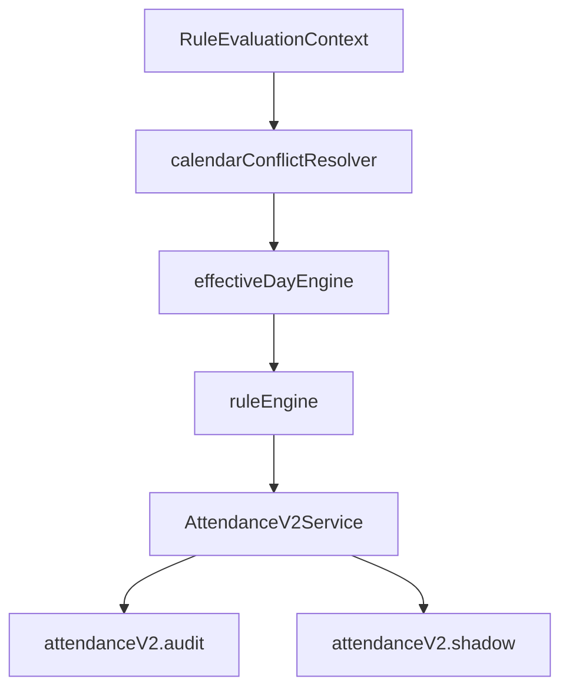

# V2 ENGINE ORCHESTRATION SPECIFICATION

Assembles V2 isolated modules (Calendar + Rules + Statuses) into a unified service.

## Architectural Flow

## API Summary
Exposes `AttendanceV2Service` with methods:
- `applyPatch(dataset, patch, actor, v1Records)`: Safely checks lock/calendar day, evaluates rules, commits update, logs audit events, and reports shadow mismatch anomalies.
- `bulkApplyPatch(dataset, patches, actor)`: Runs loop of patch updates atomically.
