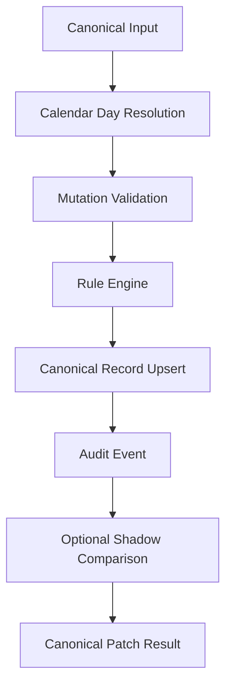

# V2 ENGINE IMPLEMENTATION: Attendance V2

## Objective
Document the isolated Attendance V2 core service that assembles Calendar + Rule + Status + Audit into canonical output while keeping V1 untouched.

## Evidence from Actual Repo Files
- Core service: `apps/frontend/src/features/attendance/v2/attendanceV2.service.ts`
- Types: `apps/frontend/src/features/attendance/v2/attendanceV2.types.ts`
- Summary helpers: `apps/frontend/src/features/attendance/v2/attendanceV2.engine.ts`
- Mutation validation: `apps/frontend/src/features/attendance/v2/attendanceV2.validation.ts`
- Audit factory: `apps/frontend/src/features/attendance/v2/attendanceV2.audit.ts`
- Shadow comparison: `apps/frontend/src/features/attendance/v2/attendanceV2.shadow.ts`
- Tests: `apps/frontend/src/features/attendance/v2/attendanceV2.test.ts`
- Lower engines: `calendar/` and `rules/`

## Findings
`AttendanceV2Service` exposes isolated operations:
- `buildDataset(input)`;
- `getDailyAttendance(dataset, date)`;
- `getMonthlyAttendance(dataset, studentId?)`;
- `getYearlyAttendance(monthlyDatasets, studentId)`;
- `validateMutation(dataset, patch)`;
- `applyPatch(dataset, patch, actorOrOptions, v1CanonicalRecords?)`;
- `bulkApplyPatch(dataset, patches, actorOrOptions)`;
- `updateNote(dataset, studentId, date, note, actorOrOptions)`;
- `computeSummary(dataset, yearlyDatasets?)`;
- `compareWithV1CanonicalResult(v1CanonicalRecords, datasetOrRecords)`.

The service returns canonical datasets and does not mutate the input dataset. Successful mutation operations return a cloned output dataset containing the updated record and audit event.

## Risks
- `HIGH`: This is still frontend-isolated. Backend persistence and authorization must be implemented before production V2 activation.
- `MEDIUM`: `enableWrite` only enables in-memory V2 mutation in the service instance. It is not database persistence.
- `LOW`: Audit IDs are generated locally for Phase 06. Backend phase should replace them with append-only persisted IDs.

## Safe Next Action
Phase 07 Backend can add a V2 storage layer behind the same canonical contracts. V1 page, hook, export, import, OCR, and schema must remain untouched until runtime cutover is explicitly approved.

## Blockers
None for Phase 07 design. Production activation remains blocked until backend persistence, auth, RLS, and shadow parity are implemented.
